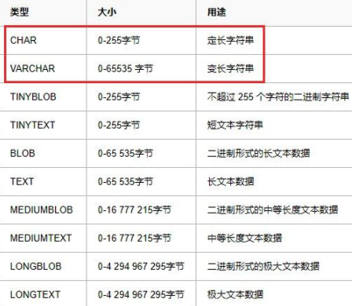

### 数据库其他概念

下面思考一个问题：数据库是如何存储数据的呢？那我们必须先熟悉如下几个概念。

- 数据：Data

  - > 描述事物的符号记录称为数据，描述事物的符号既可以是数字，也可以是文字、图片，图像、声音、语言等，数据由多种表现形式，它们都可以经过数字化后存入计算机。

  - 例如：描述一个人的基本信息就是一组数据，在数据库中叫一行记录。

  - ```
    name age sex
    
    Bobo 18  男
    ```

- 表：table

  - > table即文件，用来存放多行内容/多条记录

- 数据库：DataBase(DB)

  - > 即存放数据的仓库，我们可以把它想象成文件夹，里面存放了很多张表，每个表就是一个文件，不过数据库中的数据是按照一定的规则进行组织、描述和储存的，且具有较小的冗余度、较高的数据独立性和易扩展性，并可为各种用户共享

- 数据库管理软件

  - > 在了解了Data与DB的概念后，如何科学地组织和存储数据，如何高效获取和维护数据成了关键，这就用到了一个系统软件---数据库管理系统

  - 如MySQL、Oracle、SQLite、Access、MS SQL Server

- 数据库服务器：DB Server

  - > 运行数据库管理软件

  

### mysql介绍

- MySQL由瑞典MySQL AB 公司开发，目前属于 Oracle 旗下公司，MySQL目前是最流行的数据库管理系统。
- MySQL被广泛的应用在Internet上的大中小型网站中。由于体积小、速度快、总体拥有成本低，开放源代码
- 特点:开源,免费,应用广泛

### sql介绍

- SQL是为操作数据库而开发的一种语言，它可以用于存取数据、查询数据、更新数据和管理关系数据库系统。SQL语言由IBM开发。
- 注意：

  - 对于不同的数据库管理软件而言，SQL语句是通用的，学会了一种，其他只是一些细微的差别，毕竟人家数据库也是一个种族，语言是通用的，只不过有些存在方言的差别。

### workbench基本使用

#### 创建本地/远程连接


#### 显示数据仓库


### 库表操作DDL

#### 库的增删改查

这里的库指的数据库，也就是我们所谓的那个文件夹，对于库的操作属于SQL分类中的DDL，也就是数据库定义语言。

- 创建数据库  

  - ```sql
    create database 仓库名 charset utf8;
    ```

- 使用数据库

  - ```sql
    use 仓库名;
    ```

- 查看所有数据库和单独常看当前数据库

  - ```sql
    show databases;  #查看当前所有的数据仓库
    select database(); #查看当前使用的是哪一个数据仓库
    #注意：sql语句不区分大小写，但是sql中使用的标识符尽量控制大小写
    ```

- 修改数据库

  - 数据库的名称一旦创建好之后就无法修改

- 删除数据库

- ```sql
  drop database 仓库名;
  ```

#### 表的增删改查(重要)

##### 创建表

- ```
  create table 表名(
    字段名1 类型(宽度) 约束条件,
    字段名2 类型(宽度) 约束条件,
    字段名3 类型(宽度) 约束条件,
  );
  注意:
  	1.字段名不能重复
  	2.宽度和约束条件可选
  	3.字段名和类型是必须的
  ```

##### 查看表结构

- ```
  desc 表名；
  ```

##### 数据类型

**字符串：**顾名思义，就是存储的一连串的字符，例如文字



**数值型**：常用的有：int ，double， float


- 整数型：int 基本int能够处理日常工作中大部分整数存储问题
- 小数型：double float 

  - 强调一下float(5,2)其中5代表总长度，2代表小数长度,这个意思是整数是3位,小数是2位
- 日常工作中float足以解决小数问题了。

**日期类型**

- date：年月日

- time：时分秒
- datetime：年月日时分秒

```
create table t(date1 date,date2 time,date3 datetime);
insert into t(now(),now(),now());
mysql> select * from t;
+------------+----------+---------------------+
| date1      | date2    | date3               |
+------------+----------+---------------------+
| 2020-04-15 | 16:02:43 | 2020-04-15 16:02:43 |
+------------+----------+---------------------+
1 row in set (0.00 sec)
```

**ENUM和SET类型**：

- 这里的类似于下拉字段，在进行数据插入的时候，必须选择事先设置的内容
- 对于set而言，可以多选，但是enum只能单选


```sql
#存储100个学生的信息：学号，姓名，年纪，总成绩，毕业时间，性别，选修科目
create table student(
	  num int,
    name varchar(32),
    age int,
    score float(5,2),
    endSchool date,
    gender enum('male','female'),
    lessons set('math','sport','English')
);
```

##### 约束条件

- 为了防止不符合规范的数据进入数据库，在用户对数据进行插入、修改、删除等操作时，数据库需要按照一定的约束条件对数据进行监测，使不符合规范的数据不能进入数据库，以确保数据库中存储的数据正确性和有效型。

- 约束条件与数据类型的宽度一样，都是可选参数，主要分为以下几种：

  - NOT NULL ：非空约束，指定某列不能为空； 
  - DEFAULT:默认值
  - UNIQUE : 唯一约束，指定某列或者几列组合不能重复
  - PRIMARY KEY ：主键，指定该列的值可以唯一地标识该列记录

- primary key

  - 主键为了保证表中的每一条数据的该字段都是表格中的唯一值。换言之，它是用来独一无二地确认一个表格中的每一行数据。

  - ```
    create table t5 (
    	id int PRIMARY KEY , #主键约束 
    	name varchar(20),
    	salary float(6,2)
    ) 
    ```

- auto_increment 自增字段:

  - 对于主键id而言，往往我们可以设置为自增字段，不用手动填写

  - ```
    create table t7 (
    	id int PRIMARY KEY auto_increment, #主键约束 
    	name varchar(20)
    )
    ```

- not null:不为空，当你设置一个字段时，不允许它为空，可以使用此约束条件

- ```
  create table t1 (
  	id int PRIMARY KEY auto_increment, #主键约束
  	name varchar(20) not null #name字段的值不可以为空
  )
  ```

- default 默认值

  - 例如：对于性别一列，如果大部分都是男性，可以设置成默认值，不填则取默认值，填写了则覆盖默认值

- ```
  create table t2 (
  	id int PRIMARY KEY auto_increment, #主键约束 
  	name varchar(20),
  	sex char(10) DEFAULT('male')
  	
  )
  ```

- unique 唯一:当有一列字段你不想让它有重复值时，可以设置为唯一

```
create table t3 (
	id int PRIMARY KEY auto_increment, #主键约束 
	name varchar(20) unique, #唯一约束
)
```

- 联合唯一：只有当你设置的这些字段同时重复时才会报错

```
create table t4 (
	id int PRIMARY KEY auto_increment, #主键约束
	name varchar(20),
	dep char(10),
	UNIQUE(name,dep) #联合唯一约束
)
```

##### 修改表

- 修改表名

- ```
  alter table 旧表名 rename 新表名
  ```

- 修改表字段的数据类型

- ```
  alter table 表名 modify 字段 新数据类型
  ```

- 修改表字段名

- ```
  alter table 表名 change 旧字段名 新字段名 新数据类型 
  ```

- 新增字段

- ```
  alter table 表名 add 新增字段名 数据类型 约束条件 #约束条件可选
  ```

- 删除字段

- ```
  alter table 表名 drop 字段名
  ```

##### 查看所有的表

- ```
  show tables;
  ```

##### 删除表

```
drop table  表名;
```

### 记录操作DML

#### 插入数据

- 创建表：

  - ```sql
    create table new_dep(
    	  id int primary key,
        dep_desc varchar(30),
        dep_name varchar(30)
    );
    ```

- 插入完整的数据

  - ```
    insert into 表名 (字段1，字段2) values ('字段1的值','字段2的值')
    ```

  - ```sql
    #给指定字段插入数据
    insert into new_dep (id,dep_name,dep_desc) 
    values ('3','yanfabu','ssss')
    insert into new_dep (dep_name,dep_desc) 
    values ('销售部','ssss')
    
    #需要给所有的字段插入数据（包含自增的id子段）
    insert into new_dep VALUES (14,'哈哈','xxxx')
    ```

- 插入多条数据

  - ```sql
    insert into 表名 values ('xx1','xx2'),(xx1,xx2) #插入几条数据就写几个括号
    ```


#### 更新数据

- 单独更新一个字段

- ```
  update 表名 set 字段名 = 字段值 where 条件
  ```

- 更新多个字段

- ```
  update 表名 set 字段1 = 字段值1,字段2 = 字段值2 where 条件
  ```

- 在[安全模式](https://so.csdn.net/so/search?q=安全模式&spm=1001.2101.3001.7020)下，只能根据主键来做修改，所以使用非主键修改，那么将要解除安全模式，然后再执行操作。

  - 解除安全模式：SET SQL_SAFE_UPDATES = 0;
  - 恢复安全模式：SET SQL_SAFE_UPDATES = 1;


#### 删除数据

- 删除指定数据数据

- ```
  delete from 表名 where 条件
  ```

- 删除表中所有数据

- ```
  #不加where条件就是清空表,一定要慎重使用delete
  # 如果有自增id，新增的数据，仍然是以删除前的最后一样作为起始。
  delete from 表名;
  
  # 数据量大，删除速度比上一条快，且直接从零开始
  truncate table 表名;
  ```

#### 查询数据(重点！！！)

##### 单表查询

- 准备数据

- ```sql
  #创建员工表，字段为：
  #id自增，员工名不能为空，性别只可以为male或者female且不能为空，默认值为male
  #age不能为空，默认值28，入职日期只显示年月日，职位名称，工资保留两位小数，办公室门牌号，部门id
  create table emp (
  	id int PRIMARY KEY auto_increment,
  	name char(20) not null,
  	gender enum('male','female') default 'male',
  	age int not null default 28,
  	hire_date date,
  	job_title varchar(30),
  	salary float(10,2),
  	office_num int,
  	dep_id int
  )
  	
  数据
  insert into emp (name,gender,age,hire_date,job_title,salary,office_num,dep_id)values
  ('weiwei','male',78,'20150302','teacher',1000000.31,401,1),
  ('lala','male',81,'20130305','teacher',8300,401,1),
  ('zhangsan','male',73,'20140701','teacher',3500,401,1),
  ('liulaogen','male',28,'20121101','teacher',2100,401,1),
  ('aal','female',18,'20110211','teacher',9000,401,1),
  ('zhugelang','male',18,'19000301','teacher',30000,401,1),
  ('成龙','male',48,'20101111','teacher',10000,401,1),
  ('歪歪','female',48,'20150311','sale',3000.13,402,2),#以下是销售部门
  ('丫丫','female',38,'20101101','sale',2000.35,402,2),
  ('丁丁','female',18,'20110312','sale',1000.37,402,2),
  ('星星','female',18,'20160513','sale',3000.29,402,2),
  ('格格','female',28,'20170127','sale',4000.33,402,2),
  ('张野','male',28,'20160311','operation',10000.13,403,3), #以下是运营部门
  ('程咬金','male',18,'19970312','operation',20000,403,3),
  ('程咬银','female',18,'20130311','operation',19000,403,3),
  ('程咬铜','male',18,'20150411','operation',18000,403,3),
  ('程咬铁','female',18,'20140512','operation',17000,403,3)
  ```

- 查询所有字段信息

- ```
  select * from 表名; #星花表示的是通配符，表示所有的字段
  ```

- 查询指定字段信息

- ```sql
  select 字段1，字段2 from 表名
  select name,salary from emp #查看所有员工的姓名和薪资的信息
  ```

- 通过四则运算查询

- ```sql
  #查看员工的姓名和其年薪
  select name,salary*12 from emp
  #as可以给列起一个别名，as关键字可以省略
  select name,salary*12 as year_salary from emp
  ```

- 为库表重命名

- ```sql
  select * from emp as e #e就是emp的别名
  ```

- 条件查询where语句

  - 单条件查询

  - ```sql
    #查询销售员工的姓名和薪资
    select name,salary from emp where job_title = 'sale'
    ```

  - 多条件查询1：结合and

  - ```sql
    #查询薪资大于1w的老师对应的名字和薪资
    select name,salary from emp where job_title = 'teacher' and salary > 10000 
    ```

  - 多条件查询2：结合or

  - ```sql
    #查询薪资为3，3.5，4，9k的员工名字和具体薪资
    select name,salary from emp where salary = 3000 or salary = 3500 or salary = 4000 or salary = 9000
    ```

  - 多条件查询3：结合between...and

  - ```sql
    #查询薪资范围在1000-5000之间的员工名字和具体薪资
    select name,salary from emp where salary between 1000 and 5000
    ```

  - 多条件查询4:结合in

  - ```sql
    #查询薪资为3，3.5，4，9k的员工名字和具体薪资
    select name,salary from emp where salary in (3000,3500,4000,9000)
    ```

  - 多条件查询5:结合not in

  - ```sql
    select name,salary from emp where salary not in (3000,3500,4000,9000)
    ```

  - 模糊查询like

    - 通配符%:表示多个字符

      - ```sql
        select * from emp where name like 'a%'
        ```

    - 通配符_:表示一个字符

      - ```sql
        select * from emp where name like 'zhang___'
        ```

- 排序：order by

  - 升序： order by 字段 asc(默认升序,可以不写)

  - 降序： order by 字段 desc

  - 单列排序：
  
  - ```sql
  select * from emp order by salary
    ```

- limit

  - 显示前三条数据

  - ```sql
    select * from emp limit 3
    ```

  - 从0开始,先查出第一条,然后包含这条再往后查5条

  - ```sql
    select * from emp limit 0,5
    ```

  - 从第3开始,即先查出第4条,然后包含这条再往后查7条

  - ```sql
    select * from emp limit 3,7
    ```

