## Playwright

### 介绍

Playwright 是一个用于自动化浏览器操作的开源工具，由 Microsoft 开发和维护。它支持多种浏览器（包括 Chromium、Firefox 和 WebKit）和多种编程语言（如 Python、JavaScript 和 C#），可以用于测试、爬虫、自动化任务等场景。 

**与 Selenium 和 pyppeteer 相比，Playwright 具有以下几个区别和优势：**

1. 多浏览器支持：支持所有主流浏览器。这使得开发人员可以根据需求选择最适合的浏览器进行自动化操作。（Playwright不支持旧版Microsoft Edge或IE11）
2. 更快的执行速度：Playwright 通过使用浏览器的底层调试协议来进行操作，相比于 Selenium 和 pyppeteer，它具有更快的执行速度和更低的资源消耗。
3. 可靠性和稳定性：Playwright 提供了更可靠和稳定的浏览器自动化操作，通过使用浏览器的原生 API 来模拟用户行为，避免了一些传统自动化工具的一些限制和不稳定性。
4. 支持跨浏览器和跨平台：Playwright 可以在不同浏览器和不同操作系统上运行，这使得开发人员可以更方便地进行跨浏览器和跨平台的测试和自动化操作。
5. selenium是基于http协议，而Playwright是基于websocket协议。由于使用 HTTP 协议，Selenium 的性能相对较低。每次与浏览器进行通信时，都需要发送 HTTP 请求和等待响应。而Playwright使用 WebSocket 协议，Playwright 的性能会更高。WebSocket 的双向通信使得数据交换更高效，可以更快地获取页面内容和执行操作。
6. 支持屏幕录制功能：根据屏幕录制指定生成相关操作代码。

**在爬虫中使用 Playwright 的好处包括：**

1. 动态网页爬取：Playwright 可以模拟用户在浏览器中的操作，包括渲染 JavaScript、点击按钮、填写表单等，从而可以爬取包含动态内容的网页。
2. 多浏览器支持：Playwright 支持多种浏览器，可以根据需求选择最适合的浏览器进行爬取，以确保爬取结果的准确性和一致性。
3. 更高的稳定性和可靠性：Playwright 使用浏览器的原生 API 进行操作，避免了一些传统爬虫工具的一些限制和不稳定性，提供了更可靠和稳定的爬取能力。

总之，Playwright 是一个功能强大、跨浏览器、跨平台的浏览器自动化工具，相比于 Selenium 和 pyppeteer，它具有更快的执行速度、更高的稳定性和更广泛的浏览器支持，适用于多种自动化操作和爬虫场景。

**python版本的Playwright官网文档：**https://playwright.dev/python/docs/intro

### 环境安装

- 系统要求：
  - Python 3.8 或更高版本。
  - Windows 10+、Windows Server 2016+ 或适用于 Linux 的 Windows 子系统 （WSL）。
  - MacOS 12 Monterey 或 MacOS 13 Ventura。
  - Debian 11、Debian 12、Ubuntu 20.04 或 Ubuntu 22.04。

- 安装playwright的python版本
  - pip install playwright
- 安装Playwright所需的所有工具插件和所支持的浏览器
  - playwright install
  - 该步骤耗时较长

#### 屏幕录制

- 创建一个py文件，比如：main.py

- 在终端中，执行如下指令：

  - **playwright codegen -o main.py  **

    - 将屏幕录制生成的代码保存到main.py文件中
    - 可以通过如下设置，生成同步还是异步的代码：

    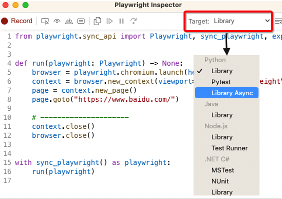

  -   **playwright codegen --viewport-size=800,600  www.baidu.com -o main.py **

    - 访问指定网址，并且设置浏览器窗口大小

  - **playwright codegen --device="iPhone 13" -o main.py**

    - 模拟手机设备进行网络请求（只支持手机模拟器，无需单独安装）
    - 支持的移动端设备如下：目前对安卓设备的覆盖率不高

    ```
    "Blackberry PlayBook",  "Blackberry PlayBook landscape",  "BlackBerry Z30",  "BlackBerry Z30 landscape",  "Galaxy Note 3",  "Galaxy Note 3 landscape",  "Galaxy Note II",  "Galaxy Note II landscape",  "Galaxy S III",  "Galaxy S III landscape",  "Galaxy S5",  "Galaxy S5 landscape",  "Galaxy S8",  "Galaxy S8 landscape",  "Galaxy S9+",  "Galaxy S9+ landscape",  "Galaxy Tab S4",  "Galaxy Tab S4 landscape",  "iPad (gen 5)",  "iPad (gen 5) landscape",  "iPad (gen 6)",  "iPad (gen 6) landscape",  "iPad (gen 7)",  "iPad (gen 7) landscape",  "iPad Mini",  "iPad Mini landscape",  "iPad Pro 11",  "iPad Pro 11 landscape",  "iPhone 6",  "iPhone 6 landscape",  "iPhone 6 Plus",  "iPhone 6 Plus landscape",  "iPhone 7",  "iPhone 7 landscape",  "iPhone 7 Plus",  "iPhone 7 Plus landscape",  "iPhone 8",  "iPhone 8 landscape",  "iPhone 8 Plus",  "iPhone 8 Plus landscape",  "iPhone SE",  "iPhone SE landscape",  "iPhone X",  "iPhone X landscape",  "iPhone XR",  "iPhone XR landscape",  "iPhone 11",  "iPhone 11 landscape",  "iPhone 11 Pro",  "iPhone 11 Pro landscape",  "iPhone 11 Pro Max",  "iPhone 11 Pro Max landscape",  "iPhone 12",  "iPhone 12 landscape",  "iPhone 12 Pro",  "iPhone 12 Pro landscape",  "iPhone 12 Pro Max",  "iPhone 12 Pro Max landscape",  "iPhone 12 Mini",  "iPhone 12 Mini landscape",  "iPhone 13",  "iPhone 13 landscape",  "iPhone 13 Pro",  "iPhone 13 Pro landscape",  "iPhone 13 Pro Max",  "iPhone 13 Pro Max landscape",  "iPhone 13 Mini",  "iPhone 13 Mini landscape",  "iPhone 14",  "iPhone 14 landscape",  "iPhone 14 Plus",  "iPhone 14 Plus landscape",  "iPhone 14 Pro",  "iPhone 14 Pro landscape",  "iPhone 14 Pro Max",  "iPhone 14 Pro Max landscape",  "Kindle Fire HDX",  "Kindle Fire HDX landscape",  "LG Optimus L70",  "LG Optimus L70 landscape",  "Microsoft Lumia 550",  "Microsoft Lumia 550 landscape",  "Microsoft Lumia 950",  "Microsoft Lumia 950 landscape",  "Nexus 10",  "Nexus 10 landscape",  "Nexus 4",  "Nexus 4 landscape",  "Nexus 5",  "Nexus 5 landscape",  "Nexus 5X",  "Nexus 5X landscape",  "Nexus 6",  "Nexus 6 landscape",  "Nexus 6P",  "Nexus 6P landscape",  "Nexus 7",  "Nexus 7 landscape",  "Nokia Lumia 520",  "Nokia Lumia 520 landscape",  "Nokia N9",  "Nokia N9 landscape",  "Pixel 2",  "Pixel 2 landscape",  "Pixel 2 XL",  "Pixel 2 XL landscape",  "Pixel 3",  "Pixel 3 landscape",  "Pixel 4",  "Pixel 4 landscape",  "Pixel 4a (5G)",  "Pixel 4a (5G) landscape",  "Pixel 5",  "Pixel 5 landscape",  "Pixel 7",  "Pixel 7 landscape",  "Moto G4",  "Moto G4 landscape"
    ```

### 保留记录cookie信息

-  **playwright codegen --save-storage=auth.json https://www.17k.com **
  - 在屏幕录制时，进行登录操作，登录后，cookie信息会被保存到auth.json文件中
- **playwright codegen --load-storage=auth.json https://www.17k.com -o main.py **
  - 基于auth.json进行屏幕录制，会自动进入到登录成功后的页面中

### 第一个Playwright脚本

- 同步模式

```python
from playwright.sync_api import sync_playwright
with sync_playwright() as p:#创建Playwright管理器
    bro = p.chromium.launch(headless=False)
    page = bro.new_page()
    page.goto('https://www.baidu.com')
    #自行设置等待时长，注意：不可使用time.sleep
    page.wait_for_timeout(1000)
    title = page.title()
    content = page.content()
    print(title,content)
    page.close()
    bro.close()
```

- 异步模式

```python
import asyncio
from playwright.async_api import async_playwright
async def main():
    async with async_playwright() as p:
        bro = await p.chromium.launch(headless=False,slow_mo=2000)
        page = await bro.new_page()
        await page.goto('https://www.baidu.com')
        title = await page.title()
        content = await page.content()
        print(title,content)
        await page.close()
        await bro.close()

asyncio.run(main())
```

### 元素定位

#### CSS选择器定位

- 语法结构：page.locator()
  - 参数：标签/id/层级/class 选择器
- 交互操作：
  - 点击元素， `click()` 方法
  - 元素内输入文本， `fill()` 方法

```python
from playwright.sync_api import sync_playwright

with sync_playwright() as p:
    bro = p.chromium.launch(headless=False,slow_mo=2000)
    page = bro.new_page()
    page.goto('https://www.baidu.com')

    #定位到输入框，进行文本录入
    page.locator('#kw').fill('Python教程') #id定位
    # 定位搜索按钮，进行点击操作
    page.locator('#su').click()
    #后退操作
    page.go_back()

    page.locator('.s_ipt').fill('爬虫')  # class定位
    page.locator('#su').click()
    page.go_back()

    page.locator('input#kw').fill('人工智能')  # 标签+属性定位
    page.locator('#su').click()
    page.go_back()

    page.locator('#form > span > input#kw').fill('数据分析') #层级定位
    page.locator('#su').click()

    page.close()
    bro.close()
```

- 设置内容输入的时间间隔

```python
from playwright.sync_api import sync_playwright

with sync_playwright() as p:
    bro = p.chromium.launch(headless=False)
    page = bro.new_page()
    page.goto('https://www.baidu.com')

    #定位到输入框，进行文本录入
    tag = page.locator('#kw') #id定位

    #设置内容的输入的时间间隔
    tag.focus() #聚焦于当前标签
    input_text = 'Hello, World!'
    for char in input_text:
        page.keyboard.type(char, delay=500)

    # 定位搜索按钮，进行点击操作
    page.locator('#su').click()

    page.close()
    bro.close()
```

- 更多操作
  - locator.all()
  - locator.count()
  - locator.nth(index)
  - inner_text()
  - get_by_text(xxx)
  - get_attribute(attrName)
- taobao在不登录情况下无法进行商品搜索，因此需要手动登录，保留Cookie信息
  -  playwright codegen --save-storage=taobao.json https://www.taobao.com
- 携带Cookie信息进行操作：
  - context = browser.new_context(storage_state="taobao.json")

```python
from playwright.sync_api import Playwright, sync_playwright, expect

with sync_playwright() as p:
    browser = p.chromium.launch(headless=False,slow_mo=2000)
    context = browser.new_context(storage_state="taobao.json")
    page = context.new_page()
    page.goto("https://www.taobao.com/")

    page.locator('#q').fill('mac pro')
    # class属性值为btn-search tb-bg，在定位的时候选择空格左右两侧任意一个属性值即可
    page.locator('.btn-search').click()
    page.wait_for_timeout(1000)

    # 根据文本定位
    page.get_by_text('发货地').click()
    page.wait_for_timeout(1000)

    # 定位到满足要求所有的标签(商品列表最外层的a标签)
    locator = page.locator('.Content--contentInner--QVTcU0M > div > a')
    all_eles = locator.all()

    # 查看定位到满足要求标签的数量
    count = locator.count()
		print(count)
    # 定位到第10个a标签,nth下标从0开始
    a_10 = locator.nth(9)
    print(a_10.get_attribute('href'), a_10.inner_text())
    print('---------------------------------------------------------------------------')
    # 获得每一个a标签中的文本内容和href属性值
    for index in range(count):
        ele = locator.nth(index)
        text = ele.inner_text()
        href = ele.get_attribute('href')
        print(text, href)

    page.close()
    context.close()
    browser.close()

```

#### xpath定位

page.locator(xpath表达式)

```python
from playwright.sync_api import sync_playwright

with sync_playwright() as p:
    bro = p.chromium.launch(headless=False,slow_mo=2000)
    page = bro.new_page()
    page.goto('https://www.bilibili.com/')

    #xpath定位
    page.locator('//*[@id="nav-searchform"]/div[1]/input').fill('Python教程')
    page.locator('//*[@id="nav-searchform"]/div[2]').click()

    page.close()
    bro.close()
```

### Context上下文

浏览器的上下文管理对象Context可以用于管理Context打开/创建的多个page页面。并且可以创建多个Context对象，那么不同的Context对象打开/创建的page之间是相互隔离的（每个Context上下文都有自己的Cookie、浏览器存储和浏览历史记录）。

- 打开百度的多个链接对应的page页面


```python
from playwright.sync_api import sync_playwright

#点击百度首页中左上角的全部链接，以打开多个不同的page页面
with sync_playwright() as p:
    bro = p.chromium.launch(headless=False,slow_mo=1000)
    #创建上下文管理对象
    context = bro.new_context()
    #基于上下文管理对象打开一个page页面
    page = context.new_page()
    page.goto('https://www.baidu.com')
    #点击百度首页中左上角的全部链接，以打开多个不同的page页面
    a_list = page.locator('//*[@id="s-top-left"]/a').all()
    for a in a_list:
        a.click()
    #使用上下文管理对象获取浏览器打开的所有page页面
    pages = context.pages
    for sub_page in pages:
        #遍历每一个page，打印起page标题
        print(sub_page.title())
		
    page.close()
    bro.close()
```

- 通过sub_page的title判断进行sub_page页面的切换和管理

```python
from playwright.sync_api import sync_playwright
#封装页面切换的函数
def switch_to_page(context,title):
    for page in context.pages:
        if title == page.title():
            #浏览器停留在此page页面
            page.bring_to_front()
            return page

#点击百度首页中左上角的全部链接，以打开多个不同的page页面
with sync_playwright() as p:
    bro = p.chromium.launch(headless=False,slow_mo=1000)
    #创建上下文管理对象
    context = bro.new_context()
    #基于上下文管理对象打开一个page页面
    page = context.new_page()
    page.goto('https://www.baidu.com')
    #点击百度首页中左上角的全部链接，以打开多个不同的page页面
    a_list = page.locator('//*[@id="s-top-left"]/a').all()
    for a in a_list:
        a.click()
    
    #page页面的切换
    select_page = switch_to_page(context,'hao123_上网从这里开始')
    #在指定的page中进行相关操作
    select_page.locator('//*[@id="search"]/form/div[2]/input').fill('测试测试')
    select_page.locator('//*[@id="search"]/form/div[3]/input').click()
    
    page.close()
    bro.close()
```

- 实战案例：
  - 抓取bili中指定关键字搜索页面中视频的标题和作者名称

```python
from playwright.sync_api import sync_playwright
from lxml import etree
#封装页面切换的函数
def switch_to_page(context,title):
    for page in context.pages:
        if title == page.title():
            #浏览器停留在此page页面
            page.bring_to_front()
            return page
          
with sync_playwright() as p:
    bro = p.chromium.launch(headless=False,slow_mo=1000)
    context = bro.new_context()
    page = context.new_page()
    page.goto('https://www.bilibili.com/')

    #xpath定位
    page.locator('//*[@id="nav-searchform"]/div[1]/input').fill('Python教程')
    page.locator('//*[@id="nav-searchform"]/div[2]').click()

    #切换到新打开的page中
    select_page = switch_to_page(context,'Python教程-哔哩哔哩_Bilibili')
    page_text = select_page.content()
    tree = etree.HTML(page_text)
    div_list = tree.xpath('//*[@id="i_cecream"]/div/div[2]/div[2]/div/div/div/div[3]/div/div')
    for div in div_list:
        title = div.xpath('.//h3[@class="bili-video-card__info--tit"]/@title')[0]
        author = div.xpath('.//span[@class="bili-video-card__info--author"]/text()')[0]
        print(title,author)
    page.close()
    bro.close()
```

### 滑动验证

- 基于opencv实现的免费操作:
  - pip install opencv-python
  - 可能会存在滑动误差，需要手动调整
  

```python
from playwright.sync_api import sync_playwright
import cv2
from urllib import request

#获取要滑动的距离
def get_distance():
    #滑动验证码的整体背景图片
    background = cv2.imread("background.png", 0)
    #缺口图片
    gap = cv2.imread("gap.png", 0)
    res = cv2.matchTemplate(background, gap, cv2.TM_CCOEFF_NORMED)
    value = cv2.minMaxLoc(res)[2][0]
    print(value)
    #单位换算
    return value * 278 / 360


#有的检测移动速度的 如果匀速移动会被识别出来，来个简单点的渐进
def get_track(distance):  # distance为传入的总距离
    # 移动轨迹
    track = []
    # 当前位移
    current = 0
    # 减速阈值
    mid = distance * 4 / 5
    # 计算间隔
    t = 0.2
    # 初速度
    v = 1
    while current < distance:
        if current < mid:
            # 加速度为2
            a = 4
        else:
            # 加速度为-2
            a = -3
        v0 = v
        # 当前速度
        v = v0 + a * t
        # 移动距离
        move = v0 * t + 1 / 2 * a * t * t
        # 当前位移
        current += move
        # 加入轨迹
        track.append(round(move))
    return track

with sync_playwright() as p:
    bro = p.chromium.launch(headless=False)
    page = bro.new_page()
    page.goto('https://passport.jd.com/new/login.aspx?')

    page.locator('//*[@id="loginname"]').fill('123456@qq.com')
    page.wait_for_timeout(1000)
    page.locator('//*[@id="nloginpwd"]').fill('123456@qq.com')
    page.wait_for_timeout(1000)
    page.locator('//*[@id="loginsubmit"]').click()

    page.wait_for_timeout(2000)

    bg_img_src = page.locator('.JDJRV-bigimg > img').get_attribute('src')
    small_img_src = page.locator('.JDJRV-smallimg > img').get_attribute('src')

    # 两张图片保存起来
    request.urlretrieve(bg_img_src, "background.png")
    request.urlretrieve(small_img_src, "gap.png")

    distance = int(get_distance())

    #定位到滑块标签
    slide = page.locator('//*[@id="JDJRV-wrap-loginsubmit"]/div/div/div/div[2]/div[3]')
    # 找到滑块在当前页面的坐标（这个会返回一个字典里边四个数字）
    #{'x': 858, 'y': 339.9921875, 'width': 55, 'height': 55}
    box = slide.bounding_box()

    #让鼠标移动到滑块标签的中间上
    page.mouse.move(box["x"] + box["width"] / 2, box["y"] + box["height"] / 2)
    # 按下鼠标
    page.mouse.down()
    # 这里获取到滑块x坐标中心点位置
    x = box["x"] + 12 #加上一个数值调整滑动误差
    # 滑动的长度放到轨迹加工一下得到一个轨迹
    tracks = get_track(distance)
    for track in tracks:
        # 循环鼠标按照轨迹移动
        page.mouse.move(x + track, 0)
        x += track
    # 移动结束鼠标释放
    page.mouse.up()

    page.wait_for_timeout(5000)
    page.close()
    bro.close()
```

- 付费操作
  - 相对精度高
  - 图鉴平台：http://www.ttshitu.com/ 

```python
#tujian.py
import base64
import json
import requests
# 一、图片文字类型(默认 3 数英混合)：
# 1 : 纯数字
# 1001：纯数字2
# 2 : 纯英文
# 1002：纯英文2
# 3 : 数英混合
# 1003：数英混合2
#  4 : 闪动GIF
# 7 : 无感学习(独家)
# 11 : 计算题
# 1005:  快速计算题
# 16 : 汉字
# 32 : 通用文字识别(证件、单据)
# 66:  问答题
# 49 :recaptcha图片识别
# 二、图片旋转角度类型：
# 29 :  旋转类型
#
# 三、图片坐标点选类型：
# 19 :  1个坐标
# 20 :  3个坐标
# 21 :  3 ~ 5个坐标
# 22 :  5 ~ 8个坐标
# 27 :  1 ~ 4个坐标
# 48 : 轨迹类型
#
# 四、缺口识别
# 18 : 缺口识别（需要2张图 一张目标图一张缺口图）
# 33 : 单缺口识别（返回X轴坐标 只需要1张图）
# 五、拼图识别
# 53：拼图识别
#函数实现忽略
def base64_api(uname, pwd, img, typeid):
    with open(img, 'rb') as f:
        base64_data = base64.b64encode(f.read())
        b64 = base64_data.decode()
    data = {"username": uname, "password": pwd, "typeid": typeid, "image": b64}
    result = json.loads(requests.post("http://api.ttshitu.com/predict", json=data).text)
    if result['success']:
        return result["data"]["result"]
    else:
        return result["message"]
    return ""


def getImgCodeText(imgPath,imgType):#直接返回验证码内容
    #imgPath：验证码图片地址
    #imgType：验证码图片类型
    result = base64_api(uname='15027900535', pwd='15027900535', img=imgPath, typeid=imgType)
    return result
```


```python
from playwright.sync_api import sync_playwright
import tujian
from urllib import request

#有的检测移动速度的 如果匀速移动会被识别出来，来个简单点的渐进
def get_track(distance):  # distance为传入的总距离
    # 移动轨迹
    track = []
    # 当前位移
    current = 0
    # 减速阈值
    mid = distance * 4 / 5
    # 计算间隔
    t = 0.2
    # 初速度
    v = 1
    while current < distance:
        if current < mid:
            # 加速度为2
            a = 4
        else:
            # 加速度为-2
            a = -3
        v0 = v
        # 当前速度
        v = v0 + a * t
        # 移动距离
        move = v0 * t + 1 / 2 * a * t * t
        # 当前位移
        current += move
        # 加入轨迹
        track.append(round(move))
    return track

with sync_playwright() as p:
    bro = p.chromium.launch(headless=False)
    page = bro.new_page()
    page.goto('https://passport.jd.com/new/login.aspx?')

    page.locator('//*[@id="loginname"]').fill('123456@qq.com')
    page.wait_for_timeout(1000)
    page.locator('//*[@id="nloginpwd"]').fill('123456@qq.com')
    page.wait_for_timeout(1000)
    page.locator('//*[@id="loginsubmit"]').click()

    page.wait_for_timeout(2000)

    bg_img_src = page.locator('.JDJRV-bigimg > img').get_attribute('src')

    # 两张图片保存起来
    request.urlretrieve(bg_img_src, "background.png")

    #基于图鉴平台实现计算滑动距离
    distance = tujian.getImgCodeText('background.png',33)
    distance = int(distance)

    #定位到滑块标签
    slide = page.locator('//*[@id="JDJRV-wrap-loginsubmit"]/div/div/div/div[2]/div[3]')
    # 找到滑块在当前页面的坐标（这个会返回一个字典里边四个数字）
    #{'x': 858, 'y': 339.9921875, 'width': 55, 'height': 55}
    box = slide.bounding_box()

    #让鼠标移动到滑块标签的中间上
    page.mouse.move(box["x"] + box["width"] / 2, box["y"] + box["height"] / 2)
    # 按下鼠标
    page.mouse.down()
    # 这里获取到滑块x坐标中心点位置
    x = box["x"]
    # 滑动的长度放到轨迹加工一下得到一个轨迹
    tracks = get_track(distance)
    for track in tracks:
        # 循环鼠标按照轨迹移动
        page.mouse.move(x + track, 0)
        x += track
    # 移动结束鼠标释放
    page.mouse.up()

    page.wait_for_timeout(5000)
    page.close()
    bro.close()
```


### 文字点击验证码处理

```python
from playwright.sync_api import sync_playwright
import tujian
from urllib import request

with sync_playwright() as p:
    bro = p.chromium.launch(headless=False)
    page = bro.new_page()
    page.goto('https://passport.bilibili.com/login?from_spm_id=333.851.top_bar.login_window')

    page.locator('//*[@id="app"]/div[2]/div[2]/div[3]/div[2]/div[1]/div[1]/input').fill('15027900535')
    page.wait_for_timeout(1)
    page.locator('//*[@id="app"]/div[2]/div[2]/div[3]/div[2]/div[1]/div[3]/input').fill('bobo@123.com')
    page.wait_for_timeout(1)
    page.locator('//*[@id="app"]/div[2]/div[2]/div[3]/div[2]/div[2]/div[2]').click()
    page.wait_for_timeout(3)

    #此处找到验证码图片将其截图保存
    ele = page.locator('//div[@class="geetest_widget"]')
    ele.screenshot(path='./code.png')
    #找到ele在当前页面的坐标{'x': 858, 'y': 335, 'width': 55, 'height': 55}
    box = ele.bounding_box()

    #提交给打码平台
    result = tujian.getImgCodeText('code.png',27)
    # result = '154,251|145,167'
    result_list = result.split('|')
    # result_list ==> ['154,251','145,167']
    # 6.根据识别出验证码的结果进行处理
    for pos in result_list:
        x = int(pos.split(',')[0])
        y = int(pos.split(',')[1])
        # page.mouse.move(box['x']+x,box['y']+y)
        # page.mouse.down()
        # page.mouse.up()  #或者直接使用click方式
        page.mouse.click(box['x']+x,box['y']+y)
        page.wait_for_timeout(500)

    # 找到确认按钮
    submit = page.locator('//div[@class="geetest_commit_tip"]')
    submit.click()
    
    page.wait_for_timeout(5000)
    page.close()
    bro.close()
```

### 规避检测

如果网站有对Playwright采取监测机制的话，比如正常情况下我们用浏览器访问淘宝等网站的 window.navigator.webdriver的值为 undefined或者为false。而使用Playwright访问则该值为true。那么如何解决这个问题呢？

- 查看taobao是否检测Playwright

```python
from playwright.sync_api import sync_playwright

with sync_playwright() as p:
    bro = p.chromium.launch(headless=False)
    page = bro.new_page()
    page.goto('https://www.taobao.com/')

    ret = page.evaluate('window.navigator.webdriver')
    print(ret)

    page.wait_for_timeout(3000)
    page.close()
    bro.close()
```

- 实现js注入，绕过检测

```python
from playwright.sync_api import sync_playwright

with sync_playwright() as p:
    bro = p.chromium.launch(headless=False)
    context = bro.new_context()
    context.add_init_script(path='./stealth.min.js')
    page = context.new_page()
    page.goto('https://www.taobao.com/')

    ret = page.evaluate('window.navigator.webdriver')
    print(ret)

    page.wait_for_timeout(3000)
    page.close()
    bro.close()
```

### 浏览器接管

#### window版本

- 首先右键 Chrome 浏览器桌面图标，找到 chrome.exe 的安装路径，然后将其添加到环境变量Path中

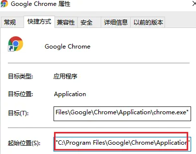

- 添加环境变量

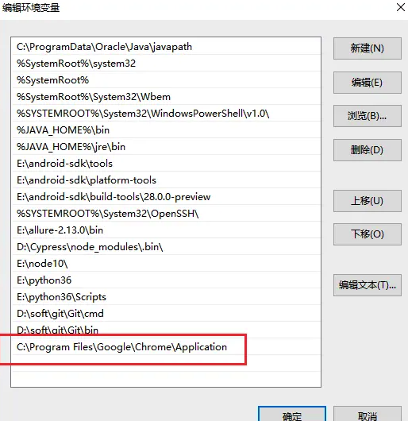

- 在任意目录下新建一个空白文件夹(playwright_chrome_data)：用于保存接管的浏览器的运行数据。

- 打开cmd输入命令启动chrome浏览器:

```
chrome.exe --remote-debugging-port=8899 --user-data-dir="E:\playwright_chrome_data"
```

--remote-debugging-port 是指定浏览器运行端口，只要没被占用就行
--user-data-dir 指定运行浏览器的运行数据，新建一个干净目录，不影响系统原来的数据

- 执行后会启动chrome浏览器
  - 可以在浏览器中手动访问百度。
- 在你已经打开的浏览器页面，手工操作登录，登录成功后，让playwright 继续操作。
- Playwright接管浏览器

```python
from playwright.sync_api import sync_playwright

with sync_playwright() as p:
    browser = p.chromium.connect_over_cdp('http://localhost:8899/')
    # 获取page对象
    page = browser.contexts[0].pages[0]
    #该操作会直接作用在接管的浏览器中
    page.locator('//*[@id="kw"]').fill('haha')
    print(page.url)
    print(page.title())

```

#### mac版本

- 找到谷歌可执行程序的完整路径

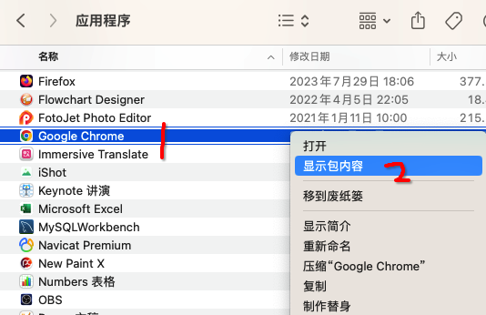

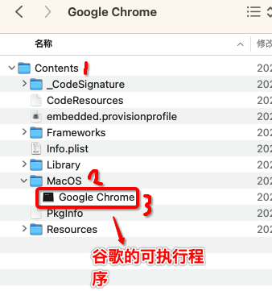

- 完整路径为：

```
/Applications/Google Chrome.app/Contents/MacOS/Google Chrome
```

- 打开终端，cd进入到该目录中，执行Google Chrome可执行程序,此时会打开一个Google浏览器

```
./Google Chrome
```

- 新建一个空白文件夹，用于保存浏览器数据
- 打开cmd输入命令启动chrome浏览器

```
./Google Chrome --remote-debugging-port=8899 --incognito --start-maximized --user-data-dir="空白文件夹路径"
```

- Playwright接管浏览器

```python
from playwright.sync_api import sync_playwright

with sync_playwright() as p:
    browser = p.chromium.connect_over_cdp('http://localhost:8899/')
    # 获取page对象
    page = browser.contexts[0].pages[0]
    #该操作会直接作用在接管的浏览器中
    page.locator('//*[@id="kw"]').fill('haha')
    print(page.url)
    print(page.title())
```

### 小红书数据爬取

- 需求：将小红书首页的推荐内容进行抓取
  - url：https://www.xiaohongshu.com/

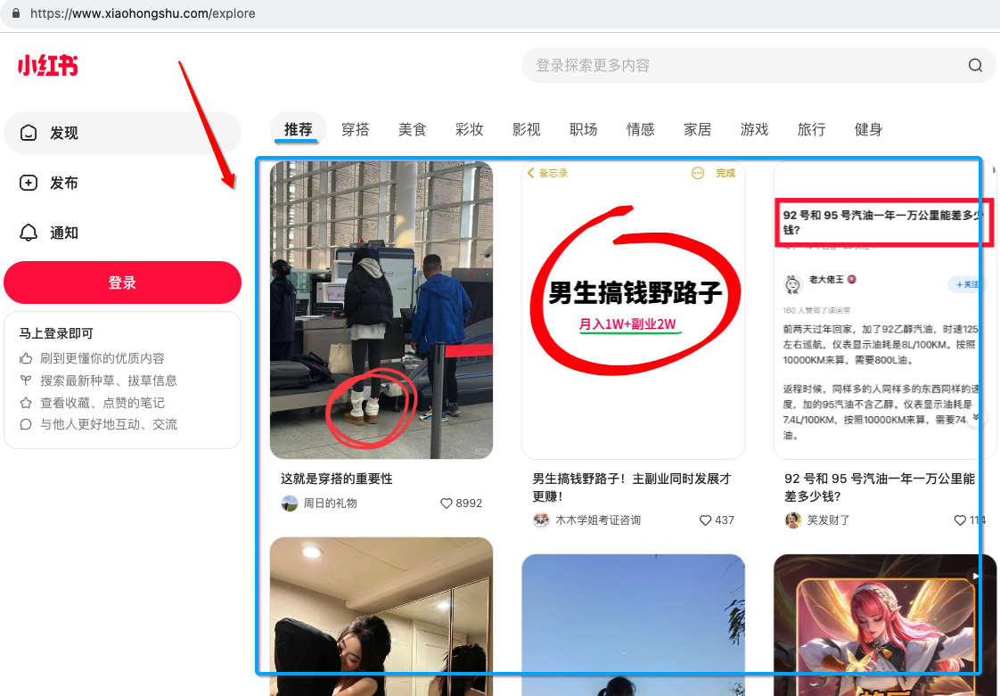

- 分析：

  - 在首页滑动滚轮会有新数据加载出来，因此分析出，我们要爬取的数据是通过ajax请求返回的。因此在抓包工具中重点监测XHR中的ajax请求数据包，最终定位到：

    - homefeed数据包
      - 响应数据就是我们想要抓取的数据。
      - 请求参数不是常规的key:value形式，而是一个json串
        - 后期在使用requests发起请求的时候，需要将json串的请求参数进行dumps操作
      - 请求头信息：
        - 包含了几个特殊的请求头X-S、X-S-Commom和X-B3等，需要具体分析是否需要处理该头信息。
      - 请求方式：POST
      - url ： https://edith.xiaohongshu.com/api/sns/web/v1/homefeed

  - 使用postman验证homefeed数据包的请求头和cookie

    - 复制homefeed的cURL(完整的请求信息)到postman中

    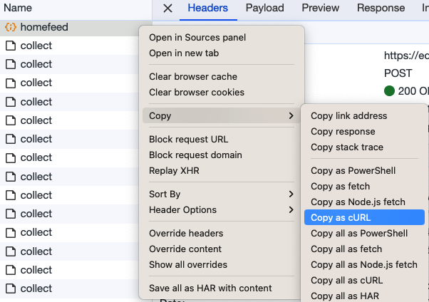

    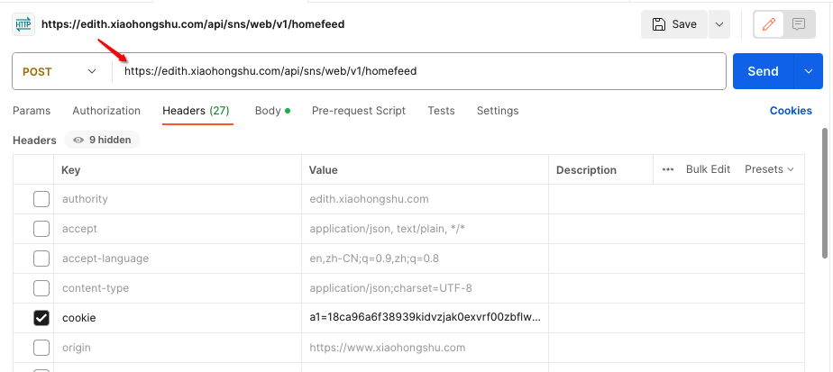

    - 在postman中经过测试，homefeed数据包只需要包含如下内容即可请求成功：
      - 请求头：content-type、cookie、user-agent和x-s
        - x-s是动态变化加密的数据，需要重点处理该请求头数据！
      - cookie：a1和web_session
        - cookie的这两个值直接从抓包工具中提取即可。

  - 断点调试找寻x-s的生成方式：

    - 选举搜索x-s，定位到指定的数据包：

    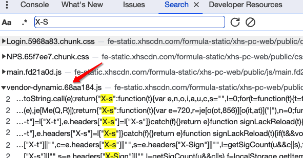

    - 此处打下断点，然后向下滑动滚轮，发起ajax请求，就会停留在该断点位置：

    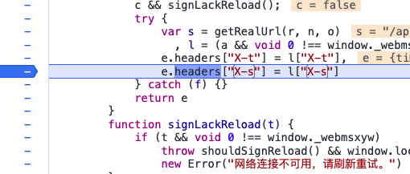

    - 断点处代码分析：

    ```js
    var s = getRealUrl(r, n, o),
    //此处为三目运算符，最终执行window._webmsxyw函数，并且传入s和i两个参数
    //参数s为固定字符串："/api/sns/web/v1/homefeed"
    //参数i为一个固定字典：直接复制即可获取
    l = (a && void 0 !== window._webmsxyw ? window._webmsxyw : encrypt_sign)(s, i) || {};
    e.headers["X-t"] = l["X-t"],
    e.headers["X-s"] = l["X-s"]
    ```

    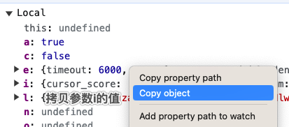

    **结论：只需要执行window._webmsxyw函数并且传入s（固定字符串）和i（数据包的请求参数）两个参数，就可得到x-s的值**

  - 使用Playwright创建浏览器环境，然后进行js注入，执行window._webmsxyw获取x-s的值，然后使用requests对homefeed包进行请求发送即可获取目标数据。

  ```python
  from playwright.sync_api import sync_playwright
  import requests
  import json
  with sync_playwright() as p:
      browser = p.chromium.launch(headless=True)
      context = browser.new_context()
      #规避检测，伪造真实浏览器环境
      context.add_init_script(path='stealth.min.js')
      page = context.new_page()
      page.goto("https://www.xiaohongshu.com")
      #设置playwright的cookie环境：经过postman测试cookie只需要保留web_session和a1两个值即可
      #cookies必须是一个数组对象，必须包含最主要的四个值：domain ，name，path，value
      context.add_cookies(
          [
              {
                  "name": "web_session",
                  "value": "030037a2b8f42aec75ab13e6f3224a2a8683e1",
                  "domain": ".xiaohongshu.com",
                  "path": "/"
              },
              {
                  "name": "a1",
                  "value": '18ca96a6f38939kidvzjak0exvrf00zbflw95v3uc30000903431',
                  "domain": ".xiaohongshu.com",
                  "path": "/"
              }
          ]
      )
      page.reload() #添加cookie后，务必要重载page页面
  
      #json_data就是参数i
      json_data = {
          "cursor_score": "1.7036686839800014E9",
          "num": 20,
          "refresh_type": 3,
          "note_index": 55,
          "unread_begin_note_id": "",
          "unread_end_note_id": "",
          "unread_note_count": 0,
          "category": "homefeed_recommend",
          "search_key": "",
          "need_num": 10,
          "image_formats": [
              "jpg",
              "webp",
              "avif"
          ]  
  }
      #进行js注入，执行window._webmsxyw函数获取x-s的值
      encrypt_params = page.evaluate("([s,i]) => window._webmsxyw(s,i)",
                                     ["/api/sns/web/v1/homefeed",json_data])
      #将返回值转换成python字典
      x_s = dict(encrypt_params)['X-s']
  
      headers = {
          'User-Agent':'Mozilla/5.0 (Macintosh; Intel Mac OS X 10_15_7) AppleWebKit/537.36 (KHTML, like Gecko) Chrome/119.0.0.0 Safari/537.36',
          'X-S':x_s,
          'Content-Type':'application/json;charset=UTF-8'
      }
      cookies = {
          'a1':'18ca96a6f38939kidvzjak0exvrf00zbflw95v3uc30000903431',
          'web_session':'030037a2b8f42aec75ab13e6f3224a2a8683e1'
      }
      url = 'https://edith.xiaohongshu.com/api/sns/web/v1/homefeed'
  
      #处理json串的请求参数
      #separators将逗号（,）作为键值对之间的分隔符，将冒号（:）作为键和值之间的分隔符。
      json_str = json.dumps(json_data,separators=(",",":"),ensure_ascii=False)
      ret = requests.post(url=url,headers=headers,data=json_str,cookies=cookies).json()
      print(ret)
  ```
  


