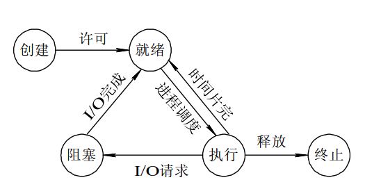

# 并发编程（并发，并行，同步，异步）

## 通俗理解并发编程中的相关核心概念

**核心概念：进程、线程**

- **CPU：**计算机的核心就是CPU，它承担了计算机所有的计算任务，它就像一座时刻都在运行的工厂。现在由于电力紧张，这个工厂一次只能有一个车间被运行，也就是说一个车间开工的时候，其他车间必须停工。这就好比单核的CPU一次只能运行一个任务（同一时刻只能干一件事）一样。同理，多核CPU就好比是可以同时启动多个车间，也就是在同一时刻，可以运行多个任务。

- **进程**   就好比工厂的车间，它代表CPU所能处理的单个任务。
- **基于车间来聊：**
  
  - 一个车间里，可以有很多工人。他们协同完成一个任务。
  - **线程**   就好比车间里的工人。**一个进程可以包括多个线程**。
- 继续思考：
  - 车间的空间是工人们共享的，比如许多房间是每个工人都可以进出的。这象征**一个进程的内存空间是被该进程下所有线程共享的**，每个线程都可以使用这些共享内存。

## 进程

### 什么是进程

- 在操作系统中，每启动一个应用程序其实就是OS开启了一个进程且为进程分类对应的内存/资源，应用程序的执行也就是进程在执行。
- 定义：一个正在运行的应用程序在操作系统中被视为一个进程
- 举例： 我们有py1文件中和py2文件，两个文件运行起来后是两个进程。

### 进程调度

- 提问：
  - 进程就是计算机中正在运行的一个程序或者软件，并且在上述工厂案例中，我们说单个CPU一次只能运行一个任务，那么你有没有在电脑上一边聊微信一边听音乐一边打游戏的场景啊？why？
    - 是因为CPU在交替运行多个进程。

- 要想多个进程交替运行，操作系统必须对这些进程进行调度，这个调度也不是随机进行的，而是需要遵循一定的法则，由此就有了进程的调度算法。
  - 目前已实现的调度算法有：先来先服务（FCFS）调度算法、短作业优先调度算法和时间片轮转法。不过被公认的一种比较好的进程调度算法是"时间片轮转法"。

```
"时间片轮转法"调度算法的实施过程如下所述。
(1) os会创建多个就绪队列存储进程，并为各个队列赋予不同的优先级。第一个队列的优先级最高，第二个队列次之，以此类推。并且该算法赋予各个队列中进程执行时间片（进程被运行的时间）的大小也各不相同，在优先级愈高的队列中，为每个进程所规定的执行时间片就愈小。例如，第二个队列的时间片要比第一个队列的时间片长一倍

(2) 当一个新进程进入内存后，首先将它放入第一队列的末尾，排队等待调度。当轮到该进程执行时，如它能在该时间片内完成，便可准备撤离系统；如果它在一个时间片结束时尚未完成，调度程序便将该进程转入第二队列的末尾，再同样地排队等待调度执行；如果它在第二队列中运行一个时间片后仍未完成，再依次将它放入第三队列。
```

### 并发与并行

- 通过进程之间的调度，也就是进程之间的切换，我们用户感知到的好像是两个视频文件同时在播放，或者音乐和游戏同时在进行，那就让我们来看一下什么叫做并发和并行。
- **并行：**同时运行，只有具备多个cpu才能实现并行
- **并发：**是伪并行，即看起来是同时运行（时间片轮转法）。
- 无论是并行还是并发，在用户看来都是'同时'运行的，不管是进程还是线程，都只是一个任务而已，真实干活的是cpu，而一个cpu同一时刻只能执行一个任务。

**举例说明**

你吃饭吃到一半，电话来了，你一直到吃完了以后才去接，这就说明你不支持并发也不支持并行。
你吃饭吃到一半，电话来了，你停了下来接了电话，接完后继续吃饭，这说明你支持并发。
你吃饭吃到一半，电话来了，你一边打电话一边吃饭，这说明你支持并行。

**总结**

并发的关键是你有处理多个任务的能力，不一定要同时。

并行的关键是你有同时处理多个任务的能力。

所以它们最关键的点就是：是否是『同时』。

### 进程的状态

在程序运行的过程中，由于被操作系统的调度算法控制，程序会进入几个状态：就绪，运行、阻塞和终止。

- 就绪(Ready)状态
  - 进程已经准备好，已分配到所需资源/内存。

- 执行/运行（Running）状态
  - 进程处于就绪状态被调度后，进程进入执行状态

- 阻塞(Blocked)状态（耗时操作）
  - 正在执行的进程由于某些事件而暂时无法运行，进程受到阻塞,则进入就绪状态等待系统调用
    - 网络请求，input等
- 终止状态
  - 进程结束，或出现错误，或被系统终止，进入终止状态。无法再执行



### 同步和异步

- 同步：
  - CPU在执行一个任务的时候，任务的每一个步骤是顺序执行的，并且必须是每前一个步骤执行完毕后才可以执行下一个步骤，这就是同步的含义。

- 异步：
  - 异步是指，任务的所有步骤也是顺序被执行，但是与同步不同的是，异步的模式下，不会等前一个步骤执行完毕后才会执行下一个步骤，而是当一个步骤一旦被执行，无论该步骤是否被执行结束，都会马上执行下一个步骤。

- 案例理解：
    - 以做饭为例：
        - 同步方式就是按照步骤依次做，先烧水，然后煮饭，最后炒菜。只有前面的步骤完成后才能进行下一个步骤。在一个步骤未完成的情况下，你不可以干任何事情。
        - 异步的方式就是，在烧水且水还没开的情况下，你可以去干其他事，比如刷手机、发邮件等。也就是在等待每个步骤完成的过程中，你可以干其他事，不必傻傻的等下去。
            - 该案例中的，烧水、煮饭和炒菜都是一些耗时操作，可以被称为**阻塞操作！**

- 注意：同步和异步针对是cup在执行任务时遇到阻塞操作时，所产生的不同行为！

思考：1是基于并行的还是基于并发的？

 - 异步可以是基于并行的也可以是基于并发的，但是大部分情况下是基于并发的。

**下面我们就一起来学习，可以实现异步的具体操作：进程、线程和协程！**

### Python进程的实现

#### multiprocessing包

multiprocess是python中管理进程的包。 之所以叫multi是取自multiple的多功能的意思,在这个包中几乎包含了和进程有关的所有子模块，提供的子模块非常多。

##### Process模块

Process模块是一个创建进程的模块，借助这个模块，就可以完成进程的创建。

之前我们说过，运行一个py文件就相当于启动了一个进程，这个进程我们成为**"主进程"**

而在主进程对应的py文件中，可以通过Process模块创建另一个进程，这个进程是基于主进程创建的，因此可以被称为**"子进程"**

当有了两个进程后，我们其实就可以实现**异步机制**了！

具体实现过程：

1.导入模块：from multiprocessing import Process

2.基于Process创建一个子进程对象(当前运行的整个py文件表示主进程)，然后可以基于target参数将外部的一个函数注册到该子进程中

3.基于start()方法启动创建好的子进程

```python
from multiprocessing import Process
def func():
    print('我是绑定给子进程的一组任务！')

if __name__ == '__main__':
    print('主进程开始执行！')
    #创建一个进程p，给该进程绑定一组任务
    p = Process(target=func)
    #启动创建好的进程
    p.start()

    print('主进程执行结束！')
```

- 如何手动给注册在子线程中的函数传递指定的参数？

  - 通过args传递参数

  - ```python
    from multiprocessing import Process
    def func(num1,num2):
        print('我是绑定给子进程的一组任务！',num1,num2)
    
    if __name__ == '__main__':
        print('主进程开始执行！')
        #创建一个进程p，给该进程绑定一组任务
        p = Process(target=func,args=(123,456))
        #启动创建好的进程
        p.start()
    
        print('主进程执行结束！')
    ```

- 使用进程实现异步效果：

  - 同步效果：

  - ```python
    import time
    def get_request(url):
        print('正在请求网址的数据：',url)
        time.sleep(2)
        print('请求结束:',url)
    
    if __name__ == "__main__":
        start = time.time()
        urls = ['www.1.com','www.2.com','www.3.com']
        for url in urls:
            get_request(url)
        print('总耗时：',time.time()-start)
    ```

- 异步效果（重要）：

  - ```python
    import time
    from multiprocessing import Process
    def get_request(url):
        print('正在请求网址的数据：',url)
        time.sleep(2)
        print('请求结束:',url)
    
    if __name__ == "__main__":
        urls = ['www.1.com','www.2.com','www.3.com']
        for url in urls:
            #创建了三个进程，表示三组任务
            p = Process(target=get_request,args=(url,))
            p.start()
    ```

- join方法的使用

  - join是需要让子进程调用的方法，主进程一定会等待调用了join的子进程结束后，主进程在结束！

  ```python
  import time
  from multiprocessing import Process
  def get_request(url):
      print('正在请求网址的数据：',url)
      time.sleep(2)
      print('请求结束:',url)
  
  if __name__ == "__main__":
      start = time.time()
      urls = ['www.1.com','www.2.com','www.3.com']
      p_list = [] #存储创建好的子进程
      for url in urls:
          #创建子进程
          p = Process(target=get_request,args=(url,))
          p_list.append(p)
          #p.join() #一定不要这么写
          #启动子进程
          p.start()
          
      for pp in p_list:#pp就是列表中的每一个子进程
          pp.join() #是的每一个子进程都执行了join操作
          #意味着：主进程需要等待所有执行了join操作的子进程结束后再结束
  
  
      print('总耗时：',time.time()-start)
  
  
  ```

- ```python
  #观察下述代码出现的问题是什么？（了解）
  from multiprocessing import Process
  import time
  ticketNum = 10 #全部的车票
  def func(num):
      print('我是子进程，我要购买%d张票！'%num)
      global ticketNum
      ticketNum -= num
      time.sleep(2)
  
  if __name__ == '__main__':
      p = Process(target=func,args=(3,))
      p.start()
      #主进程在子进程结束之后在结束
      p.join() #只有当子进程结束后，join的调用结束，才会执行join后续的操作
      print('目前剩余车票数量为:',ticketNum) #输出结果依然是10
      #进程和进程之间是完全独立。两个进程对应的是两块独立的内存空间，每一个进程只可以访问自己内存空间里的数据。
  ```
  
  - 如果主进程的查询结果是在2s中后才出现的，则join生效了。但是查询结果为什么是这样的呢？
  
    - 首先，ticketNum = 10这个变量是存在于主进程中的，然后再func函数中ticketNum则是将全局变量ticketNum的值拷贝到了子进程中的ticketNum变量中，因此在func中的减法操作只能作用在子进程的变量中。最终，最后一行主进程打印的ticketNum则是原来主进程未发生变量的值。
  - 如何解决？(自己可以尝试文件共享)
    - 进程通信机制，管道，信号量等(没必要掌握，日后用不到)
  
  - 继续思考：一个子进程函数的返回值如何被主进程获取？
  
  - **总结：进程之间的数据是隔离的，也就是数据不共享**
  
 
##### 守护进程（了解）

那么如果有一天我们的需求是我的主进程结束了，由主进程创建的那些子进程必须跟着结束，怎么办？守护进程就来了！

```python
import time
from multiprocessing import Process
def get_request(url):
    print('正在请求网址的数据：',url)
    time.sleep(2)
    print('请求结束:',url)

if __name__ == "__main__":
    start = time.time()
    p = Process(target=get_request,args=('www.1.com',))
    # 将当前p这个子进程设置为了守护进程
    p.daemon = True #该操作必须放置在子进程启动操作之前
    p.start()

    print('主进程执行结束')
```

主进程创建守护进程后：

　　其一：守护进程会在主进程代码执行结束后就终止

　　其二：守护进程内无法再开启子进程,否则抛出异常：AssertionError: daemonic processes are not allowed to have children

注意：主进程代码运行结束，守护进程随即终止！

## 线程

#### 基本概念

**线程：**线程是操作系统能够进行运算调度的最小单位（车间里的工人），它被包含在进程之中，线程是进程中的实际运作单位。

注意：

​	1.同一个进程内的多个线程是共享该进程的资源的，不同进程内的线程资源肯定是隔离的

​	2.创建线程的开销比创建进程的开销要小的多

​	3.每一个进程中至少会包含有一个线程，该线程叫做"主线程"

**思考：多线程可以实现并行吗？**

- 在CPU资源比较充足的时候，一个进程内的多个线程，是可以被分配到不同的CPU上的，这就是通过多线程实现并行。但是这个分配过程是由操作系统实现的，不可人为控制。

#### Python实现线程

##### python线程模块的选择

Python提供了几个用于多线程编程的模块，包括thread、threading和Queue等。但是threading模块更为先进，对线程的支持更为完善，因此推荐大家使用该模块！

##### threading模块

- 线程的创建

```python
from threading import Thread
def func(num):
    print('num的值是:',num)

if __name__ == '__main__':
    #创建好了一个子线程（在主线程中创建）
    t = Thread(target=func,args=(1,))
    t.start()
```

- join()方法

```python
from threading import Thread
import time
def run():
    print('当前子线程正在执行')
    time.sleep(2)
    print('当前子线程执行结束')

if __name__ == '__main__':
    start = time.time()
    ts = []
    for i in range(3):
        t = Thread(target=run) #创建线程对象
        t.start() #启动线程对象
        ts.append(t)
    for t in ts:
        t.join()
    print('总耗时:',time.time()-start)
```

- 线程内存数据共享：

```python
from threading import Thread
import time
def work():
    global n
    n = 0 #将全局变量修改为了0
if __name__ == '__main__':
    n = 1 #全局变量
    t = Thread(target=work)
    t.start()
    print(n) #在进程中输出全局变量的值就是线程修改后的结果为0
```

- 守护线程
  - 无论是进程还是线程，都遵循：守护xx会在主xx运行完毕后被销毁，不管守护xx时候被执行结束。
  
  - ```python
    from threading import Thread
    import time
    def work():
        time.sleep(1)
        print('子线程正在执行！')
    if __name__ == '__main__':
        t = Thread(target=work)
        t.daemon = True #当前的子线程设置为了守护线程
        t.start()
        print('主线程结束！')
    ```

- 多线程实现的异步效果：

```python
import time
from threading import Thread
start = time.time()
def get_requests(url):
    print('正在爬取数据')
    time.sleep(2)
    print('数据爬取结束')

urls = ['www.1.com','www.2.com','www.3.com','www.4.com','www.5.com']
ts = []
for url in urls:
    t = Thread(target=get_requests,args=(url,))
    t.start()
    ts.append(t)
for t in ts:
    t.join()

print('总耗时:',time.time()-start)

```

#### 线程池

线程预先被创建并放入线程池中，同时处理完当前任务之后并不销毁而是被安排处理下一个任务，因此能够避免多次创建线程，从而节省线程创建和销毁的开销，能带来更好的性能和系统稳定性。

```python
from multiprocessing.dummy import Pool #导入了线程池模块
import time
urls = ['www.1.com','www.2.com','www.3.com','www.4.com','www.5.com']
def get_reqeust(url):
    print('正在请求数据：',url)
    time.sleep(2)
    print('请求结束:',url)
start = time.time()
#创建一个线程池,开启了5个线程
pool = Pool(5)
#可以利用线程池中三个线程不断的去处理5个任务
pool.map(get_reqeust,urls)
#get_reqeust函数调用的次数取决urls列表元素的个数
#get_requests每次执行都会接收urls列表中的一个元素作为参数

print('总耗时：',time.time()-start)
pool.close() #释放线程池
```

### 协程（重要！）

**协程可以实现在单进程或者单线程的模式下，大幅度提升程序的运行效率！**

- 假设我们有一个需求：从一个URL列表中下载多个网页内容，假设下载一个网页内容需要耗时2秒。
  - 在传统的多线程或多进程模型中，我们会为每个URL创建一个线程或进程来进行异步的下载操作。但是这样做会有一个问题：
    - 计算机中肯定不会只有下载URL的这几个进程/线程，还会有其他的进程/线程（Pycharm、音乐播放器、微信、网盘等）。
    - 将每一个下载网页的操作封装成一个进程/线程的目的就是为了实现异步的网页数据下载，也就是当一个下载网页的操作出现阻塞后，可以不必等待阻塞操作结束后就可以让计算机去下载其他网页内容（CPU切换到其他网页下载的进程/线程中）。
    - 但是，计算机中启动的进程/线程那么多，你确定每次CPU进行进程/线程切换，都会切换到网页下载的进程/线程中吗？答案是不一定，因为这个进程/线程切换是由操作系统实现的，无法人为干涉。那么，这些网页下载任务的执行的效率就降低下来了。因此，可以使用协程来解决该问题！
  - 协程处理多个网页内容下载任务：
    - 将所有的网页下载任务全部封装在一个进程/线程中，基于单进程/单线程来实现多个网页下载的任务。
    - 在这个下载任务的单进程/单线程，需要我们自己主动监测出所有的阻塞环节，使得cpu在这些阻塞环节切换执行，这样当前下载任务的单进程/单线程处于就绪态就会增多，以此来迷惑操作系统，操作系统便以为当前的下载任务是阻塞比较少的单进程/单线程，从而会尽可能多的分配CPU给我们，这样也就达到了提升程序执行效率的目的。
    - 因此，有了协程后，在单进程或者单线程的模式下，就可以大幅度提升程序的运行效率了！
  - 总而言之，就是想尽一切办法留住CPU在我们自己的程序中，从而提升整个程序的执行效率！


